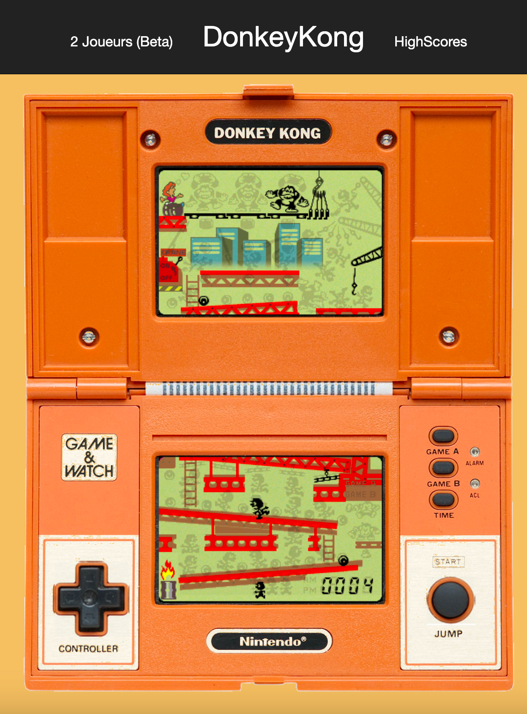

# Game And Watch - Donkey Kong (Javascript)

**Conception docs (in French)**: [Conception docs](ressources/conception.md)  
**Try it online**: https://lmagniez.github.io/DUT-GameAndWatch/index.html

Project developed during my first year at university using javascript.

We were asked to develop a javascript version of the [Game&Watch called Donkey Kong](https://en.wikipedia.org/wiki/List_of_LCD_games_featuring_Mario#Donkey_Kong) released in 1982
It was my first experience working using git.

