# Game And Watch Donkey Kong

- Loïck Magniez  
- Maxime Détaille  
- Laurent Franchois  
- Gautier Borowczyk

# 1. Introduction

A notre début de S4 PEL, nous avons choisi ce projet tutoré de Game and Watch dans le but de pouvoir découvrir un nouveau langage (qui n’a pu être abordé que brièvement).

Notre principale motivation fut donc la découverte d’un nouveau langage (Javascript), associé avec de nouveaux concept (sprites, canvas), le tout en équipe. C’est durant ce projet que nous avons découvert le logiciel GIT, permettant ainsi un partage du code facile en évitant les pertes d’informations.

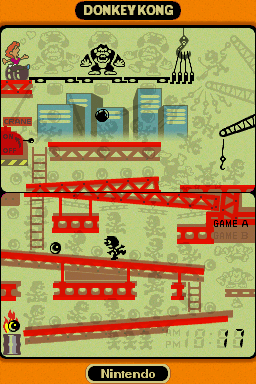

Nous allons dans ce projet chercher à reproduire tel quel le Game & Watch Donkey Kong sorti en 1982, un an après la sortie de son homologue sur borne d’arcade.  
Pour ce qui est de l’aspect graphique, nous nous sommes servis des sprites de la version Nintendo DS, qui ne change rien au gameplay du jeu.  

On incarne ici Mario, qui va tenter encore une fois de sauver la princesse. Cette fois-ci, c’est à Donkey Kong qu’il va avoir affaire.  
Pour sauver la princesse, il va devoir escalader les poutres, activer le levier et sauter pour attraper les crochets qui tiennent en équilibre Donkey Kong.

Cela parait simple, mais il y a des obstacles qui vont tenter de l’en empêcher. On a une barre qui apparait de temps à autre mais surtout les tonneaux (barrels) que Donkey Kong lance du haut de l’immeuble.  
Mario va devoir éviter les tonneaux en sautant par-dessus, il gagne même des points en faisant cela !

Mario dispose de 3 vies pour sauver la princesse, il va devoir grimper tout en haut 4 fois pour faire tomber Donkey Kong.

# 2. Phase de tutoriels

Au début du S4, notre cursus ne nous avait pas donné l’occasion de faire du JavaScript, c’est pour cela que nous avons dû nous initier à ce langage sur quelques tutoriels mêlant affichage, événements et interactions.

## 2.1 - Pong (HTML5 canvas + Javascript)

**Le canvas**  
Nous avons d’abord commencé par découvrir ce qu’était un canvas.  
C’est un cadre d’une dimension donnée qui va nous permettre de dessiner des images à l’intérieur.  
Dans ce premier tutoriel, nous n’avons dessiné que de simples formes (rectangle blancs, texte)  

**Séparer les types d’entités**  
Nous avons également appris une règle sur les canvas :  
On va séparer les différents types d’entités sur différents canvas.  
Dans notre tutoriel : On a séparé le terrain (background), les raquettes+balles (joueurs), et le score (jeu)  
Cela permet une meilleure fluidité, évite de rappeler inutilement l’affichage d’une partie du code, et rend le code plus lisible.

## 2.2 - Sprite Pièce (Javascript)

**Update/Render**
Ce second tutoriel nous a introduit au concept de sprite.  
Ce qu’on retiendra de ce tutoriel et la séparation entre mise à jour logique et graphique.  
Pour chaque sprite, on aura alors une fonction **Update** qui fera la mise à jour logique (modifie la valeur des variables en fonction de la situation) et une fonction **Render** qui se chargera d’afficher sur les canvas les différents sprites. La seconde fonction est beaucoup plus simple que la première car ne fait pas de changements de variables.  
 **Feuille de sprite**  
On a donc été introduits au concept de feuille de sprites, où on va insérer chaque image de l’animation souhaité dans celle-ci. On affiche qu’une partie de l’image à chaque render et on modifie la partie a chaque update.

# 3. Conception du jeu

## 3.1 - Les différentes classes

Diviser les classes par entités, chaque entité dispose de sa feuille de sprite (plus facile pour afficher)  
Le tout sera lancé dans l’ordre suivant depuis la page html  

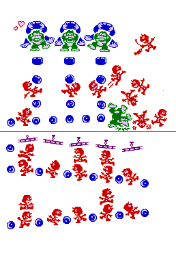

**Entités du jeu :**  
\-Mario (Déplacement clavier, collisions)  
\-Donkey Kong (+les mains de DK qui ne lance pas)  
\-Tonneaux (+les mains de DK qui lance, dépend de la position de DK)  
\-Obstacle  
\-Interrupteur  
\-Grue  
\-Crochet  
\-Plateforme  
\-Vie de DK  
\-Vie de mario  
\-Score  

**Manette :**  
\-Bouton  

**Fonction principale :**  
\-**Game** (gameLoop, génération des objets ci dessus)

## 3.2 - Différents événements de jeux

### 3.2.1 - Mort :
**Déclenchement :** 

- On avance sur un tonneau  
- Un tonneau avance sur nous  
- On avance dans le vide (2e étage)  
- On loupe la grue lors d’un saut (Animation différente)  
- On saute et percute un obstacle  

**Conséquence :**

- Perd une vie (Game over si 0 vie)  
- Réinitialise la position du joueur, mais ne réinitialise pas les tonneaux (game and watch original)  

### 3.2.2 - Victoire :

**Déclenchement :**
- On saute sur le crochet  
**Conséquence :**
- Retire un crochet à DK (+20pts) (Animation)  
- Si plus de crochet, Victoire (+20 pts) et réinitialise crochet

### 3.2.3 - Saut :
**Déclenchement :**
- Touche de saut sur un emplacement correct  

**Conséquence :**
- Si on saute pour la grue : Tester le crochet, victoire ou mort  
- Saute au dessus d’un tonneau : 1er palier->1pt 2e palier->2pts

### 3.2.4 - Déplacement de DK :
**Déclenchement : **
- Au bout de x frames, DK se déplace soit à droite, soit à gauche (Si peut pas se déplacer, bouge pas)

### 3.2.5 - Apparition de tonneau :
**Déclenchement :**
- Aléatoire, pars de la position de DK  

**Conséquence :**
- Apparition d’un tonneau suivant le pattern défini  
- REMARQUE : Plus le temps passe, plus le jeu s’accélère !

### 3.2.6 - Apparition d'obstacle : 
**Déclenchement :**
- Aléatoire  

**Conséquence :**
- L’obstacle parcoure la longueur, si mario le touche en sautant, mort  
- REMARQUE : Déplacement ne se faisant pas en même temps que les tonneaux !!  

### 3.2.7 - Interrupteur : 
**Déclenchement :**
- Mario actionne l’interrupteur en avançant dans sa direction.  
**Conséquence :**
- La grue est actionnée, elle va faire 2 allers retours avec son crochet (5 positions), puis se désactive.

### 3.2.8 - Animation perd :  
- Clignote sur sa position plusieurs fois de suite

### 3.2.9 - Animation tombe :  
- Trébuche  
- Tombe  
- Clignote (Utiliser animation perd)

### 3.2.10 - Animation de victoire :  
- Saute sur le crochet  
- Lève la grue  
- Rabaisse la grue  
- Retour au début  

### 3.2.11 - DK est battu :  
- DK clignote  
- DK tombe avec les barres  
- Cœur de la princesse qui s’anime

## 3.3 - Description des classes

### 3.3.1 - Classe barrel

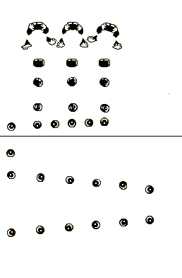
Classe gérant la génération et le défilement des tonneaux.  
La génération d’un tonneau dépend de la position de Donkey Kong.

Ci-dessous, un tableau représentant les différentes positions des barrels

| **IdBarrel(idDK)   \[X,Y\]   \[L,H\]** | 0 (DK 0)  \[38,31\]  L=31 H=19 |     | 4 (DK 1)  \[88,31\]  L=30 H=18 |     | 8 (DK 2)  \[137,32\]  L=32 H=21 |
| --- | --- | --- | --- | --- | --- |
|     | 1  \[47,83\]  L=16 H=12 |     | 5  \[94,83\]  L=16 H=12 |     | 9  \[140,83\]  L=141 H=110 |
|     | 2  \[47,110\]  L=14 H=13 |     | 6  \[95,109\]  L=14 H=13 |     | 10  \[141,110\]  L=14 H=13 |
|     | 3  \[47,146\]  L=13 H=11 |     | 7  \[97,146\]  L=13 H=12 |     | 11  \[142,147\]  L=13 H=12 |
| 17  \[10,173\]  L=12 H=12 | 16  \[47,171\]  L=12 H=11 | 15  \[72,170\]  L=12 H=11 | 14  \[96,168\]  L=12 H=11 | 13  \[120,168\]  L=12 H=11 | 12  \[142,166\]  L=12 H=12 |
| 18  \[9,211\]  L=12 H=11 |     |     |     |     |     |
| 19  \[10,242\]  L=12 H=11 | 20  \[52,245\]  L=11 H=12 | 21  \[93,249\]  L=12 H=11 | 22  \[131,249\]  L=12 H=11 | 23  \[169,256\]  L=11 H=12 | 24  \[206,262\]  L=12 H=12 |
| 30  \[10,325\]  L=12 H=12 | 29  \[51,319\]  L=12 H=12 | 28  \[92,316\]  L=12 H=11 | 27  \[130,312\]  L=12 H=12 | 26  \[169,309\]  L=12 H=11 | 25  \[206,305\]  L=12 H=12 |

**Variables globales :**  
barrels\[\] : tableaux de sprite  
barrelX : valeur x pour chaque case ci-dessus (constante)  
barrelY : valeur y pour chaque case ci-dessus (constante)  
barrelL : valeur L pour chaque case ci-dessus (constante)  
barrelH : valeur H pour chaque case ci-dessus (constante)

**Objet Sprite**  
\-positionBarrel : entre 0 et 30  
\-positionDK : entre 0 et 2 (position d’où part le tonneau)  
+update : fais avancer le barrel selon le trajet défini (utilise tableaux ci-dessus)  
+fais le test de collision avec mario  
+render : affiche le barrel

Fonction génererBarrel(positionDK) : génère un barrel en fonction de la position de DK

**Déplacement des tonneaux : cas particuliers (on avance de +1 à chaque frame dans le cas normal)**

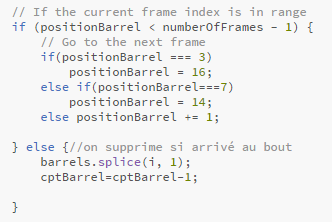

### 3.3.2 - Classe DK

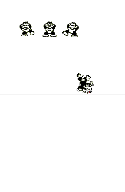

Classe gérant le déplacement de donkey kong et de ses mains lorsqu’il ne lance pas de barrel.  
DK dispose de 4 positions. Il ne peut accéder à la position 4 que quand il n’a plus de vie (il tombe)  
 On a 2 types de sprites dans cette classe : Le corps de DK et ses 2 mains.  
On affiche les mains de DK que lorsqu’il ne lance pas de barrel.  
On utilise la position de DK pour afficher la bonne position des mains

**Affichage d’une main :**

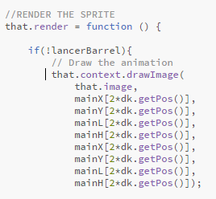

**dk, mains**

Position DK :  
dkX=\[42,89,129\]  
dkY=\[44,44,45\]  
dkL=\[33,29,35\]  
dkH=\[30,31,31\]

Position mains :  
mainX=\[30,66,80,113,123,159\]  
mainY=\[56,52,54,54,50,57\]  
mainL=\[15,14,12,12,15,14\]  
mainH=\[14,12,13,13,10,13\]  
 function spriteDK : Gere le sprite de DK et le déplace toutes les 50 frames  
function spriteMain : Fait le rendu des mains de DK en fonction de sa position

### 3.3.3 - Classe Game

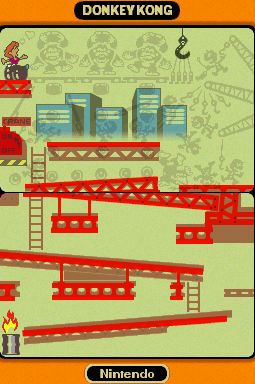

**function gameLoop :**  
boucle du jeu faisant l’ensemble des update et render sur les différentes entités  
**function update :**  
gère quand DK lance un barrel  
gère l’apparition des obstacles  
 Canvas : gère les sprites  
Canvas2 : gère le background  
Canvas3 : gère le pad  
Canvas4 : gère le bouton de saut

### 3.3.4 - Classe Mario

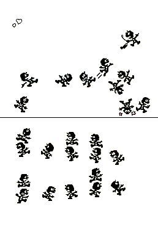

Gestion des déplacements et des sauts de mario  
On initialise ici les événements clavier

**Touche directionnelles et effets sur le déplacement:**

**Droite:** 0123 (+1) 6789 (-1) 12,13(+1) 14(chute)**Gauche :** 1234 (-1) 5678(+1) 12(levier) 13,14(-1)**Haut :** 4,9,10,11(+1)**Bas :** 5,10,11,12(-1)**  
Saut : 0,3,6,7**

| Saut | Grue | Chute | Safe zone | Chemin |     | 19  |
| --- | --- | --- | --- | --- | --- | --- |
|     |     |     |     |     | 18  |     |
| 12-> | \-> | 13 -> | \-> | 14 ^ -> |     | 20  |
| ^11 |     |     |     |     | 15  |     |
| ^10 |     | 24  | 23  |     | 16  |     |
| ^9  | <- 8 | <- 7 | <- 6 | <-5 |     |     |
| 21  |     |     | 22  | ^   |     |     |
| 0 -> | 1 -> | 2 -> | 3 -> | ^4  |     |     |

MarioX=\[25,69,106,146,181,  
178,146,106,67,26,26,  
23,33,90,130,  
191,177,194,  
158,196,222,  
27,145,146,107\]  
MarioY=\[309,305,302,299,294,  
246,242,240,234,233,210,  
158,118,120,117,  
115,131,161,  
95,50,159,  
285,275,219,216\]  
MarioL=\[22,22,21,20,24,  
25,19,22,21,23,25,  
24,29,28,26,  
29,25,28,  
27,33,23,  
23,23,22,21\]  
MarioH=\[24,24,24,24,26,  
24,25,24,26,24,25,  
26,26,22,26,  
24,24,29,  
34,31,26,  
22,23,23,22\]

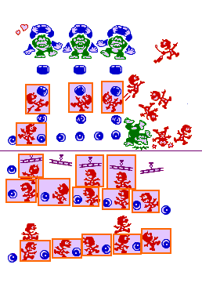

Si tab\[posMario\]==posBarrel -> collision  
var collisionBarrel=\[29,28,27,26,25,24,23,21,20,19,-1,16,2,6,10\];

Collisions à établir pour quand mario se déplace et quand les barrels se déplacent :  
Barrel -> Vérifie à chaque fois déplacement  
Mario -> En fonction du déplacement :  
Si avance (+1) : test avec case actuelle  
Si recule (-1) : Doit vérifier la collision avec la case précedente  
 On réalise de la même manière les collisions avec les obstacles

Dans la classe Mario

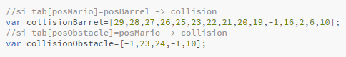

Test collision obstacle

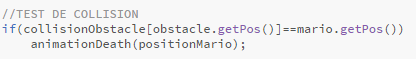

Fonction de test de collision appelé à chaque fois que Mario se déplace

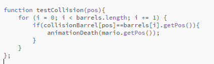

On effectue aussi un test dans la classe barrel (à chaque fois que les barrels se déplacent)

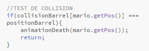

 

### 3.3.5 - Obstacles

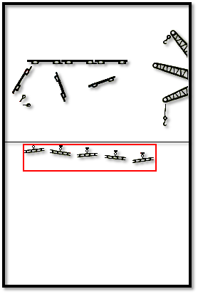

Se déclenche toutes les 30 secondes. (instance créée)  
Effet : Si mario se trouve sur l’emplacement approprié, il perd une vie et repart à la position initiale.

var obstacleX= \[179,140,101,63,26\]  
var obstacleY= \[207,204,200,197,197\]  
var obstacleL= \[30,30,29,29,30\]  
var obstacleH= \[15,14,14,15,11\]

### 3.3.6 - Grue et bouton

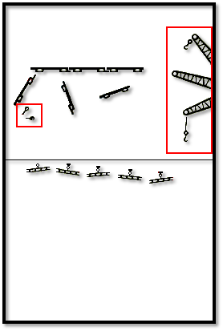

**Grue**  

3 positions (désactivé, activé, gagne)  
1 instance toujours présente

var grueX=\[221,207,222\] ;  
var grueY=\[114,81,35\] ;  
var grueL=\[36,50,34\] ;  
var grueH=\[56,24,39\] ;  

**Bouton**

2 positions (activé désactivé)Si mario avance en direction du bouton, activation du bouton  
\-> Active la grue et démarre le crochet  
 var boutonX=\[20,25\]  
var boutonY=\[126,138\]  
var boutonL=\[9,11\]  
var boutonH=\[10,5\]

### 3.3.7 - Crochet

On utilise ici une feuille de sprite qui n’est pas directement bien positionné car on aurait des chevauchements (On en reparlera plus loin dans les problèmes et solutions).  
On multiplie la longueur par la position pour obtenir l’image souhaitée.  
 
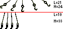

5 positions, instancie lorsque le bouton est actionné.  
Fais 2 aller retours avant de se détruireEffet : Débloque la possibilité de gagner  
Effet destruction : Désactivation du bouton

var spriteCrochetX= \[0,21,42,63,84\] ;  
var spriteCrochetY= \[0,0,0,0,0\] ;  
 var crochetX=\[183,192,205,212,218\] ;  
var crochetY=\[86,89,91,93,94\] ;  
var crochetL=\[21,14,6,11,16\] ;  
var crochetH=\[17,22,24,21,13\] ;

Initialisation du crochet à partir du bouton :

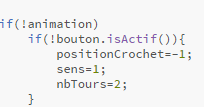

 

### 3.3.8 - Vie DK

 De la même manière que les crochets, on utilise une feuille de sprite différentes pour éviter les chevauchements.  
4 instances, se détruise une par une lorsqu’on gagne  
Si les 4 instances détruites, animation de victoire

var plateformeX = \[143,10,69,117\] ;  
var plateformeY = \[87,86,94,100\] ;  
var plateformeL = \[141,28,17,38\] ;  
var plateformeH = \[6,39,42,16\] ;

var vieDKX = \[172,178,184,189\] ;  
var vieDKY = \[51,51,51,51\] ;  
var vieDKL = \[10,6,6,7\] ;  
var vieDKH = \[33,33,33,33\] ;  
 

### 3.3.9 - Plateforme

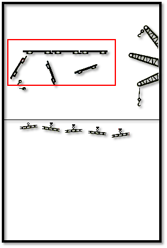

Classe à but purement décoratif.  
Pas d’incidence sur les autres classes.  
Change de position que lorsque DK tombe

### 3.3.10 - Vie mario

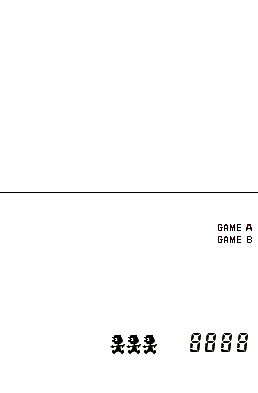

var vieY = \[341,341,341\] ;  
var vieL = \[15,15,15,15\] ;  
var vieH = \[19,19,19,19\] ;

Simple compteur de vie, on fait un tableau de 3 vie en début de partie, on splice le tableau dès qu’on retire une vie, et si le tableau est vide, game over.

### 3.3.11 - Score

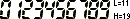

ScoreX= \[188,203,219,235\]  
ScoreY= 339  
ScoreL=11  
ScoreH=19  
 Quelques petites difficultés pour obtenir un à un les chiffres du score.

**Dans la classe dk : test si on saute au dessus du barrel**

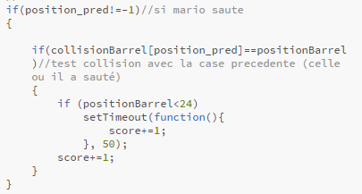

Bouton + Pad

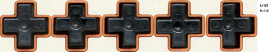
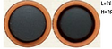

Il a fallu ici créer des nouveaux canvas et les positionner correctement pour pouvoir créer une animation sur les boutons de la console.  
 Ici on a un simple update/render qui change en fonction de la touche appuyée.

**Update du bouton :**

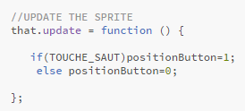

**Update du pad :**

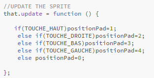

## 3.4 - Amélioration : Mode 2 joueurs

Vers la fin du projet, nous avons mis en place un mode 2 joueurs.  
Les modifications ont été rapides, voici la liste des classes modifiées/créées :

**Mario (modification) :**  
On rajoute les événements clavier pour DK :  
Touche A : aller à gauche  
Touche Z : aller à droite  
Touche E : lancer un barrel  
 **Game2J :**  
Reprise de Game, on retire la génération de barrel aléatoire (on garde les obstacles).  
On créé un compteur qui joue un son dès qu’on peut lancer un barrel  
 **DK2J :**  
Reprise de DK  
On modifie le update pour qu’il marche de la même manière que mario (Gestion des booléens pour se déplacer)  

# 4. Difficultés rencontrées

## 4.1 - Récupération des sprites :

Trouver une feuille de sprite pour un game & watch n’était pas chose aisée. 
Celui que nous avons choisi de réaliser n’était pas dispo sur le web.  
Nous avons du créer nous même la feuille de sprite.  

Nous avons donc opté pour solution la suivante :  
Nintendo a sorti un jeu sur nintendo ds regroupant les classiques de Game&Watch.  
Il a fallu donc **émuler le jeu** avec Desmume, et lancer une fonctionnalité propre au logiciel qui est de **masquer les couches** que l’on souhaite et **récupérer les sprites** affichés à l’écran.  

La récupération a été fastidieuse, mais on a pu de ce fait organiser les feuilles de sprites comme on le souhaitait. 

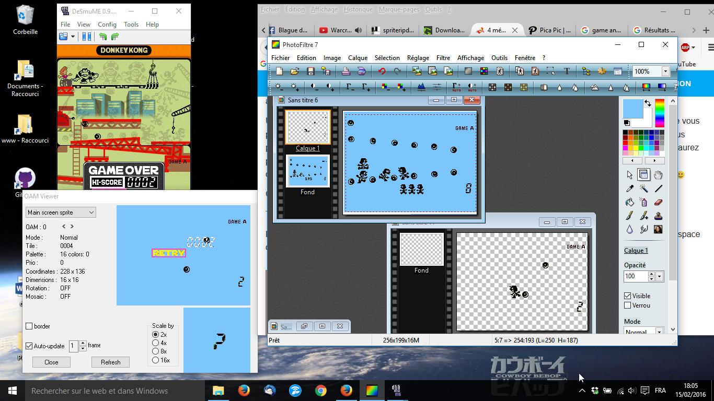

## 4.2 - Associer une position pour chacun des sprites :

Une autre tâche longue et fastidieuse :  
Pour chaque sprite, il faut associer un ensemble valeur id,X,Y,L,H.  
Pour l’id, on a cherché à faire le plus logique possible (voir ci-dessous)  
Tandis que pour X,Y,L,H, il a fallu regarder un à un la position des sprites (j’ai utilisé photofiltre et son outil de sélection).  

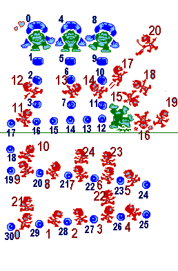

## 4.3 -Mise en place du git

Au début du S4, nous n’avons pas encore été initiés à git.  
Il a fallu apprendre par nous même à utiliser cet outil de gestion de versions.  
Nous n’avons utilisés que les fonctions principales (add, commit, push, pull)

Le projet était déjà bien avancé lorsque nous l’avons abordé de manière plus poussé en cours.  

## 4.4 - Décalage des sprites

A un stade avancé de l’implémentation du jeu, on a voulu associer un skin de game&watch pour intégrer le jeu au site, cependant, je n’ai pas pris en compte l’espace entre les 2 écrans.  
Il a fallu donc créer un espace entre les 2 écrans de chacune des feuilles de sprites. Après avoir créer l’espace sur les feuilles, on a utilisé une constante qu’on a appliquée sur toutes les positions déjà rentrées.  

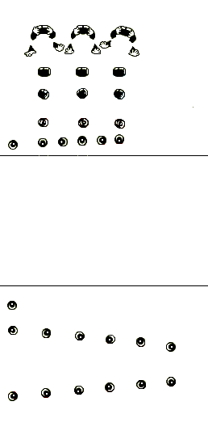

## 4.5 - Problème de chargement du Background

Petit problème qui aura perduré tout au long de l’implémentation, il y a eu un problème de chargement du fond d’écran (il fallait actualiser sur firefox, et il n’y en avait pas du tout sur chrome).  
Pour régler le problème, on a déplacé la génération du fond d’écran sur la boucle principale.

## 4.6 - Intégrer la base de données des scores

Voir la partie de Maxime sur l’implémentation des high score.  

## 4.7 - Contraintes liées aux banques de données disponibles

N’ayant pu trouver une banque de sons satisfaisante pour la réussite de notre projet, nous avons dû la créer avec nos propres moyens à l’aide d’émulateurs existants en ligne. Nous voulions un univers sonore fidèle au jeu original, essentiel au joueur pour découvrir Donkey Kong et plus encore pour recréer le même sentiment à celui qui connaît déjà le jeu.

Après avoir trouvé l’émulateur qui disposait de sons originaux, notre travail s’est établi en trois phases :

- La capture de l’ensemble des sons qui peuvent exister pour toutes les interactions entre joueur et jeu : Pour cela il a fallu enregistrer à même la sortie de la carte son d’une machine faisant interagir l’émulateur
- Le découpage : La difficulté résidait dans la reconnaissance précise de chacun de sons possibles et de son association à une action ou à un évènement dans le jeu
- L’implémentation des sons dans le code : Nous avons appliqué ces sons que l’on a converti au préalable au format OGG dans le code du jeu, ainsi à chaque évènement nous déclenchons la lecture du son correspondant

L’implémentation des sons originaux rend ainsi un véritable cachet à notre impression lors d’une phase du jeu.

# 5. Améliorations possibles

## 5.1 - Fonctionalité Tactile / Cliquable

Comme sur le site de référence, on pourrait ajouter une possibilité d’appuyer sur les touches du game&watch avec la souris ou avec du tactile (fonctionnel sur téléphone).

## 5.2 - Fonctionnalité online

Nous avons implémenté un prototype de jeu à 2 joueurs.  
On peut imaginer une fonctionnalité online en partant de ce prototype.

## 5.3 - Revoir la génération des barrels/obstacles :

La génération des barrels et obstacles se fait de manière cyclique tous les X frames.  
On pourrait imaginer une variable aléatoire pour X qui permettrait de rendre le jeu moins prévisible.  

Pour ajouter de la difficulté, on pourrait également accélérer la vitesse du jeu au fur et à mesure que le temps passe/que le score augmente.  
Il faudrait alors réduire les valeurs de tickPerFrame pour chaque classe d’obstacles.

## 5.4 - Eviter la répétition des mêmes morceaux de codes :

En particulier entre le mode 1 joueur et 2 joueurs, il y a certainement moyen de concaténer les deux en faisant varier les update en fonction du nombre de joueurs.

## 5.5 - Modification des feuilles de sprites : Utiliser des feuilles paires et impaires

Il est possible de modifier la structure des feuilles de sprites afin d’éviter le chevauchement des différents sprites.  
Il faudrait utiliser deux feuilles simultanément afin de ne pas rencontrer ce problème. Pour les positions paires, on utilise la feuille 1, pour les positions impaires la feuille 2.

# 6. - Concernant la page des Highscores

Cette page est destinée a accueillir un classement des meilleurs scores réalisé.

Nous avons donc vu la chose comme une simple base de donnée avec une colonne id pour différencier chaque score, une colonne nom ou pseudo pour pouvoir repérer les pseudos des différents joueur ayant réalisé un score, et enfin un score qui indique le résultat obtenu à la fin de votre partie.

Comme notre jeu devait être en JavaScript, nous voulions créer une base de données en JavaScript grâce à sql.js qui est une adaptation de Sqlite3 mais en JavaScript.

Sqlite3 est une autre méthode de gérer une base de donnée, le gros avantage qu'elle a est d'être vraiment minuscule et de se stocker dans un fichier qui ne pèse pas plus de 10ko (Cela dépend de la taille de la base de donnée bien entendu).

Elle utilise le langage SQL et permet de faire toute sorte de requête pour gérer une base de données.

Cela correspondais totalement à nos attentes à savoir, manipulable avec du JavaScript, une mise en place relativement simple, et sur ultra compacte.

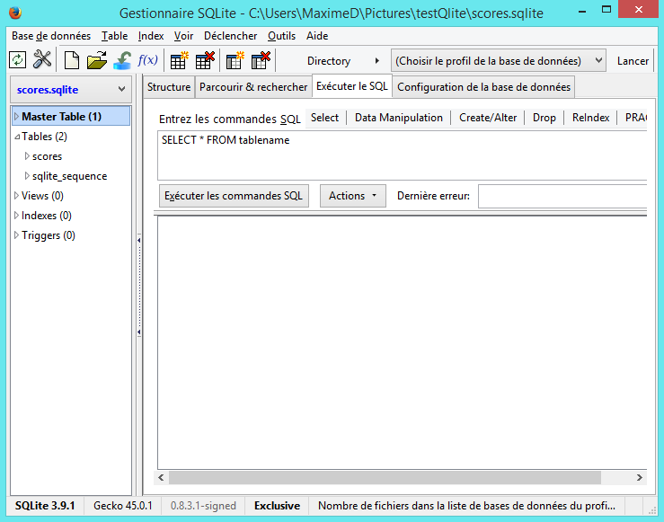

Dans un premier temps nous avions rempli la base de données avec des scores et des noms aléatoire histoire de la remplir.

Ensuite est arrivé la partie JavaScript, nous avons eu quelques soucis étant donné que la solution était un tableau de tableau associatif de tableau de tableau, alors pour récupérer la bonne valeur et la mettre la ou l'on veut il faut chercher un peu.

Mais nous en sommes parvenus et l'affichage réalisé correspondait à nos attentes.

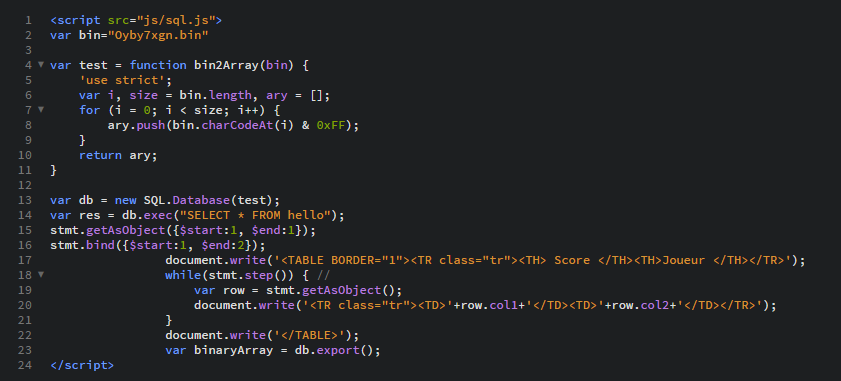

En effet car étant débutant dans le JavaScript et ne connaissant pas toutes les différentes facette de cet univers, j'ai appris après pas mal d'heure de recherche sur différents forum que l'on ne peut pas écrire dans un fichier en JavaScript.

Cela nous a donc posé un grand problème qui est que l'on ne pouvait pas sauvegarder la base de données. Donc à chaque actualisation de notre page internet la base de donnée revenait dans son état initial c'est à dire, vide.

Suite à cet échec, nous décidons de mettre en place une base de donnée mais cette fois non pas en JavaScript mais en python qui paraissait tout aussi simple syntaxiquement même peut-être plus simple.

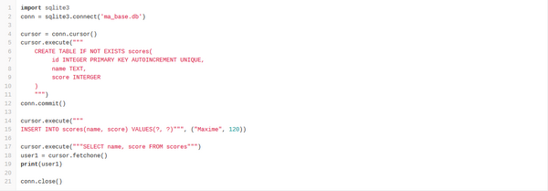

J'ai pour ce faire installer easyPHP un serveur php local qui permet d'herberger un serveur.

J'avais tout pour travailler en Python et faire ma base de donnée, je créer le script en local l’exécute, enfin cela fonctionne. Mais comme c'est un affichage en local cela s'inscrit dans ma console python et non dans ma page web.

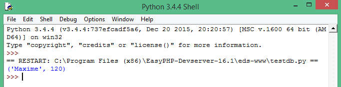

Et là encore un autre problème, mon serveur local n'accepte apparemment pas l’exécution de mon script.

Après toute ces déceptions je me résigne donc de faire ma base de donnée en Php toujours grâce à Sqlite, et la déception en déception encore un autre problème mon serveur ne gère pas Sqlite…

Je finis donc à utiliser de manière « classique » la base de donnée sql c'est à dire grace au objet PDO (vu au semestre 3), là encore j'ai eu quelques problèmes pour récuperer les différentes valeurs car celle-ci sont en javascript. J'ai pour cela utilisé un simple formulaire ou j'ai attribué à deux « input » différent le pseudo et le score du joueur.

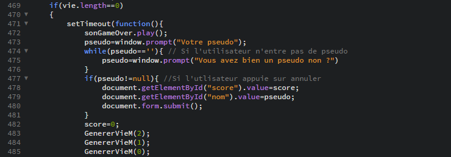

J'envoie tout cela vers ma page save.php qui insert les valeurs dans ma base de données et ensuite je renvoie l'utilisateur sur la page des highscores pour qu'il puisse voir là où il se situe par rapport aux autres joueurs.

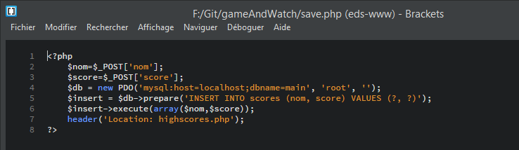

Affichage des joueurs

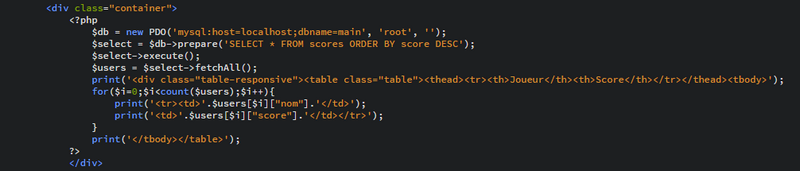

# 7. Calendrier

- **6/02 :** tuto pong + canvas (son+différentes entités sur différents canvas+evenement clavier)

- **9/02 :** tuto sprite (structure update, canvas)

- **11/02 :** Test de GIT (add, commit, push, pas encore vu en cours)

- **15/02 :** Récupération des sprites (Emulateur ds (desmume) game and watch collections) permet d’extraire les sprites manuellement (fallait tous les faire apparaitre pour reconstruire la feuille de sprite)  
Ensuite, il a fallu séparer les sprites pour chaque classes

- **16/02 :** Tonneaux qui s’écoulent simplement

- **17/02 :** DK + background  
DK génère tonneaux en fonction de sa position (DK + mains)

- **18/02 :** Mario déplacement

- **20/02 :** Mario déplacement, saut + collisions tonneaux

- **03/03 :** Animations, Simplification du code, plateforme

- **05/03 :** Ajout du score, Simplification code

- **09/03 :** Mise en forme du site / Adaptation Sprite à la console (décalage)

- **14/03 :** SQLite + tableau score

- **19/03 :** Répétition des touches, vies de DK, Son

- **24/03 :** Canvas des boutons

- **25/03 :** Prototype 2 joueurs

- **29/03 :** Mise en place HighScore

- **30/03 :** Correction background, position score

8. Le ressenti des différents membres de l’équipe

**Loïck Magniez**

Ce que je retiendrais de ce projet est avant tout est l’importance que joue la manière de concevoir le jeu/l’application.  
Un code clair et bien structuré favorise la compréhension et donc la cohésion dans l’équipe.  
La phase de tutoriels fut primordiale afin de partir sur de bonnes bases (que l’on connaisse ou non le langage, les concepts de sprites furent tout aussi important).

J’ai découvert l’outil Git durant ce projet et ce fut une révélation pour moi. A la fin de ce projet, j’ai le sentiment d’avoir acquis de nouvelles habitudes dans ma manière de programmer, de partager le travail.  
A long terme, j’aimerai approfondir mes connaissances sur l’outil. Il est pour moi la clé d’un travail d’équipe efficace. J’ai conscience qu’il y a encore du chemin à faire, mais ce projet m’a d’autant plus motivé pour apprendre à travailler en équipe.

**Laurent Franchois**

L’annonce d’un tel projet n’a pas été sans craintes de ma part. Nous n’avions aucune connaissance pour l’ensemble de notre groupe, et nous devions recréer un jeu qui ne paraissait pas à notre portée dans les premiers temps. Nous avions un défi sur plusieurs niveaux, outre celui évoqué à l’instant, l’entente et l’organisation dans le groupe était incertain, étant de plus un groupe où les membres sont réunis pour leur prochain départ à l’étranger afin de mener leurs stages, et non pas par affinités.

Nous n’avions donc jamais collaboré ensemble dans la conduite d’un projet, mais nous avons su entendre chacun et surtout tirer profit des compétences des différents membres. L’exemple dans l’utilisation du GIT, cela n’a pas été systématique pour l’ensemble des membres qui n’avaient pas tous cette familiarisation avec l’interface, malgré tout nous avons utilisé d’autres moyens de diffusion à côté du GIT, sans que cela pose problème.

La conduite du projet à son terme est pour moi très gratifiant, cela ne me laisse pas indifférent d’assister à une session de jeu et de voir la fidélité à laquelle le jeu a été conduit. J’en retiendrai essentiellement une plus grande aisance en Javascript, mais surtout la joie que nous avions tout au long du projet lorsque résolvions des problèmes qui étaient inhérents à notre code parfois des heures durant.

**Gautier Borowczyk**

Mon ressenti par rapport à ce projet se décompose en plusieurs étapes.  
 Tout d'abord je me suis étonné d'avoir été mis dans l'un des seul s groupes imposés. En effet, je ne connaissais pas tout le monde dans celui ci alors que mes camarades ont eu l'aisance de choisir le groupe qui leur plaisait. Cependant, la communication étant de rigueur, nous nous sommes tout de suite bien entendu et nous avons pu émettre des vœux qui nous plaisait à chacun sur les projets proposés.

Par la suite, le sujet attribué fut le Donkey Kong. A partir de ce moment là, j'ai dû m'impliquer dans l'apprentissage de nouvelles technologies. Cependant la compréhension et la facilité d'adaptation n'était pas la même pour chacun. Ce n'est pas pour autant que le projet en a souffert. En effet, nous nous sommes réparti le travail en fonction de nos aptitudes. De plus, la communication étant la clef du projet, nous avons mis en place divers moyens d'échanges.

Au final j'en ressort grandi et heureux du travail accompli. De part le travail d'équipe que nous avons pu mener sans disputes ainsi que par un travail abouti mais aussi par le bonheur procuré lors d'une partie du code durement achevée. En effet, voir que ce que l'on a codé fonctionne parfaitement reste un moment de satisfaction personnel que j'ai pu partagé avec mes amis.

**Maxime Detaille**

Grâce à ce projet j'ai pu retenir certaines choses très importantes. Tout d'abord je me suis vite aperçu que le travail d'équipe était au centre du projet en lui-même, sans une bonne cohésion le projet risque de ne pas aboutir.

Pour améliorer la cohésion d'équipe l'outil GIT a été un énorme atout non négligeable. Il nous a fait gagner énormément de temps et nous a surtout permis de voir l'avancé de chacune des personnes du groupe.

Il restait ensuite la partie la plus compliqué qu'était le JavaScript.

Un nouveau langage pour moi malgré certaine base de la terminale. L'apprentissage ne fut pas fastidieux car avec les outils modernes qui existent tel que CodeAcademy qui est pour moi l'un des meilleurs sites pour pouvoir apprendre des langages de programmation tout seul. Le JavaScript est un langage facile d'accès et vraiment puissant je pense qu'il prendra de plus en plus de place dans le web. On peut déjà le voir garce à des Framework comme Meteor.js ou Node.js qui sont puissant et facile d'accès.

Ce projet a réellement été bénéfique pour moi et me permet aujourd'hui d'affronter le stage et les études supérieures différemment. Je sais comment fonctionne un projet de A à Z et je connais des outils qui me permettront plus tard de gagner du temps et de la cohésion au niveau de mon travail.

- 1. Je sais aussi comment faire pour m'adapter à certain langage que je ne connais pas.

# 9. Conclusion

Le projet Donkey Kong nous a premièrement paru complexe à mener jusqu’à son terme, reposant sur un langage qui nous était inconnu ou très peu familier selon les membres du groupe. Il nous a alors fallu en apprendre sur le JavaScript, et nous avons su endossé cette tâche, assimilant notions de « canvas », de types d’entités puis « d’update » ainsi que de « render ».

Ce n’est à l’évidence pas sans impasses desquelles nous avons su nous défaire que nous avons progressé dans l’avancement du projet, que ce soit avec le chevauchement des feuilles de sprites, ou l’environnement audio-visuel de notre jeu, solutionnées respectivement à l’aide de feuilles dites pairs et impaires, et à celle de logiciels de capture multimédias.

Cela n’a été faisable à la seule condition de l’entente du groupe, héritant de membres n’ayant eu le choix concernant sa composition. Là encore nous avons su nous défaire d’un individualisme de tous les niveaux, au profit d’un échange fluide et fructifiant à l’aide d’une répartition des tâches dynamique, et pensée avec le niveau de chacun dans différentes parties du projet. Appuyés par des plateformes comme GIT ou autre pour ceux n’ayant l’aisance nécessaire, ou la machine disposée à l’utilisation du GIT, nous avons développé un sens plus grand de la collaboration lors d’un projet de cette ampleur.

Survivra à ce projet pour l’ensemble d’entre nous, outre les diverses compétences en JavaScript et les modules employés à la réussite du projet, une grande satisfaction personnelle découlant de la réussite d’un tel projet, moteur indéniable dans la poursuite de nos études dans ce domaine ou dans le monde professionnel.
